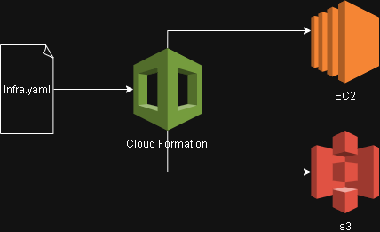

# Projeto: Implementando Infraestrutura Automatizada com AWS CloudFormation
O objetivo deste repositório é demonstrar o meu aprendizado na **prática**  e implementar uma **infraestrutura automatizada com AWS CloudFormation de forma simulada e segura.**

## CloudFormation e automatização 
-  O AWS CloudFormation é um serviço da AWS que auxilia na automação de criação de recursos na AWS por meio de templates escritos em JSON ou YAML.
-  Template do CloudFormation: **[Arquivo YAML](CloudFormation/infra.yaml)**

## Funcionamento 
- Para essa simulação eu escolhi YAML, caso esse arquivo fosse executado na AWS, o comando seria:
``` bash
aws cloudformation create-stack \
  --stack-name simulacao-leh \
  --template-body file://infra.yaml
```

 - O **CloudFormation** através desse arquivo yaml, irá:
   1. Criar o bucket S3;
   2. Criar o grupo de segurança com portas 22 e 80 abertas;
   3. Criar a instância EC2 vinculada a esse grupo.

- **Arquitetura exemplificando esse fluxo:** <br/>


## Processo: 
  1. O desenvolvedor cria/escreve o arquvio YAML.
  2. O CloudFormation lê e interpreta o arquivo e retorna com os recursos descritos.
  3. Todos os recursos ficam organizados dentro de uma **stack**.
  4. Quando a stack é excluída, todos os recursos dentro dela são removidos automaticamente.
 ```yaml
[CloudFormation Template]
        │
        ▼
[Stack: simulacao-leh]
  ├─ S3 Bucket: simulacao-leh-bucket
  ├─ Security Group: permite SSH e HTTP
  └─ EC2 Instance: t2.micro
```
(Conteúdo ilustrativo e fictícío)
### Objetivo: Apresentar um exemplo prático de como um arquivo YAML define recursos na AWS, como:
- Um **bucket S3** (armazenamento de arquivos)
- Uma **instância EC2** (máquina virtual)
- Um **grupo de segurança** (controle de acessos)

### Conclusão: 
 Me esforcei para exemplificar o uso do **CloudFormation**, implementando uma infraestrutura automatizada de forma segura e sem acessar diretamente a AWS, para evitar custos. Com isso, pude aprender como o AWS CloudFormation funciona e interpreta arquivos YAML, automatizando a criação de recursos na AWS.

#### Referências:
[Documentação oficial da AWS](https://docs.aws.amazon.com/pt_br/forecast/latest/dg/tutorial-cloudformation.html)
